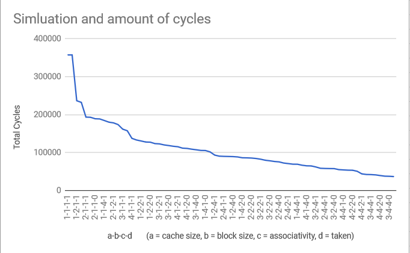

# Caching
There are five functions that powers the caching portion of the project. 
1. Initialize
2. Replace on miss
3. Update on hit
4. Trap address
5. Finalize

## Initialize
To begin, the basic values needed for caching:  index, blocksize, tag, cache_size, associativity, and offset are calculated. Then, the function will dynamically create the cache based on the information the user entered using a double for-loop.

## Replace on miss
The idea behind this function is to replace one of the blocks in the cache if the memory is not found. To accomplish this, the first item in the queue is replaced. Then, all other items will perculate down based on the spot being removed. This process ensures that the least used cache will be freed up for a more useful piece of memory. 

## Update on hit
When a memory is found within the cache, the cache also needs to be updated based on the age of the memory. Based on the principle of locality, if a memory is used, then it is likely that it will be used again. In this case, the index of the entry is found, and will perculate up within the cache to be found more easily. 

## trap address
This function determines if the address is in the cache, and will call the appropriate functions based on the outcome. To accomplish this, one needs to find the index and the tag, which will require the Block # and the # of sets. If address is made up of tag, set index, and offset, then to attain block number you must remove the bits corresponding to the offset. Hence it is bit shifted to the right by the blockoffsetbits total value. To find the number of sets, simply compute 2^cache_index. hence add 0's to the left of 1 cache_index times. If the entry is valid and the tags match, then the cache hits. If the cache is not directly associative, then update on hit function will be called. 

## Finalize
This function prints out all the summary statistics, including Cache performance and Pipeline performance. For the cache performance part, the useful statistics are number of Cache access, number of cache misses, number of cache hits, and cache miss rate. 

# Pipelining

In the pipelining simulator, the functions that are involved are

1. Parsing the Instruction
2. Pushing the Pipeline Stage
3. Processing the Pipeline Rtype

## Parsing the Instruction

The given code parses the instruction, finding out whether the instruction is already in the cache or not.

## Pushing the Pipeline Stage

This function is reponsible for moving instructions along in the pipline, and determining if stalls or forwarding is needed for the program to pipeline successfully.

### 2. Branch Prediction
In the case that the instruction is a branch, determine if next the next instruction loaded is the next instruction and branch predict if not.

If the branch prediction was wrong, add a cycle and then push the stages through and add a nop.

If the branch was correct, then nothing else happens.

### 3. LW Delays
First, check if the data is in the cache. We have a hit if so; otherwise, we have a miss, and the pipeline is delayed by `CACHE_MISS_DELAY`s. 

Next, check if the ALU stage is r-type. If so, check if one of the first two ALU registers mach the MEM destination register. In that case, write the data from the MEM stage to the WRITEBACK stage, and reset MEM to nop. 

### 4. SW Delays
First, check if the data is in the cache. If a miss, delay by `CACHE_MISS_DELAY`.

### 5. Normal Processing
Increment pipeline cycles, representing normal processing.

### 6. Push Stages
Copy data in each stage to successive stages.

### 7. Reset FETCH
Insert a nop into the FETCH stage.

